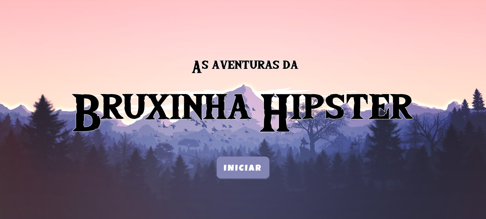

<h1 align="center">
  As Aventuras da Bruxinha Hipster
</h1>

<p align="center">
  <a href="https://brunoh-imersao-gamedev.netlify.app" target="_blank">🔗 Live Preview</a>&nbsp;&nbsp;&nbsp;|&nbsp;&nbsp;&nbsp;
  <a href="#-projeto">🖥️ Projeto</a>&nbsp;&nbsp;&nbsp;|&nbsp;&nbsp;&nbsp;
  <a href="#-tecnologias">🚀 Tecnologias</a>&nbsp;&nbsp;&nbsp;|&nbsp;&nbsp;&nbsp;
  <a href="#-license">📝 License</a>
</p>

<p align="center">
  <a href="https://wakatime.com/badge/user/68660678-6b86-4b78-98df-f5f41a37e1bc/project/7165bb5a-9eed-4e2c-bbde-d1362356b947"></a>
</p>



## 💻 Projeto

Projeto do evento "Imersão GameDev" da Alura.

## 🚀 Tecnologias

Esse projeto foi desenvolvido com as seguintes tecnologias:

- HTML
- CSS
- JavaScript
- [p5js](https://p5js.org/) - Biblioteca com 2 funções principais: ``` setup() ``` e ``` draw() ```

## :memo: Licença

Esse projeto está sob a licença MIT. Veja o arquivo [LICENSE](LICENSE) para mais detalhes.

---
